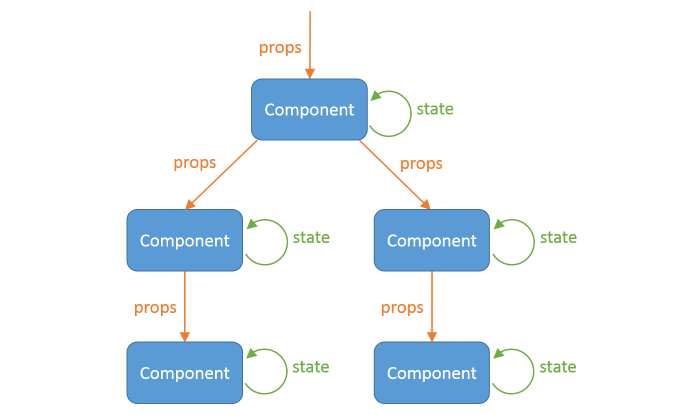

# ⚛¿Qué es React?⚛

## 📌Marco Teórico

- 🔹 React es una librería de JavaScript declarativa, eficiente y flexible para construir interfaces de usuario complejas e interactivas, es una de las más populares.
- 🔹 React es un proyecto de código abierto creado por Facebook.
- 🔹 React , permite componer pequeñas piezas de la interfaz de usuario(UI) y aisladas piezas de código llamadas “componentes”, que se pueden reutilizar en diferentes sitios de la aplicación.
- 🔹 React no es un framework, es utilizado con otras bibliotecas para renderizar en ciertos entornos. Por ejemplo, React Native puede usarse para desarrollar aplicaciones móviles; React 360
  permite crear aplicaciones de realidad virtual; además de otras posibilidades.
- 🔹 React se usa para construir interfaces de usuario (UI) en el front-end.
- 🔹 React es la capa de vista de una aplicación MVC (Modelo Vista Controlador).
- 🔹 React es válido para hacer componentes que se pueden usar dentro de aplicaciones ya existentes lo que aumenta sus capacidades.
- 🔹 React tiene una API simple, da libertad para poder trabajar con otras tecnologías.
- 🔹 React es SPA (single-page application o aplicación de página única), es una aplicación web o es un sitio web que cabe en una sola página con el propósito de dar una experiencia más fluida a los usuarios, como si fuera una aplicación de escritorio.

## 📌Objetivo principal

El objetivo principal de React es minimizar los errores que ocurren cuando los desarrolladores construyen interfaces de usuario. Esto lo hace mediante el uso de componentes /piezas de código lógicas y auto-contenidas que describen una parte de la interfaz del usuario. Estos componentes se pueden juntar para crear una interfaz de usuario completa, y React abstrae la mayor parte del trabajo de renderizado, permitiéndote enfocarte en el diseño de la interfaz.

Los componentes de React generalmente se escriben usando JSX(JavaScript Syntax Extension, extensión de la sintaxis del lenguaje JavaScript), aunque no es necesario (los componentes también se pueden escribir en JavaScript puro).

## 📌Características

React tiene las siguientes características:

- 🔹 React es programación orientada a componentes.
- 🔹 El desarrollo Declarativo Vs Imperativo.
- 🔹 Tiene su flujo de datos unidireccional.
- 🔹 Mantiene un virtual DOM propio.
- 🔹 Es isomórfico, es cuando el código de una aplicación puede ejecutarse tanto en el servidor como en el cliente.
- 🔹 Utiliza Elementos y JSX.
- 🔹 Tiene componentes con y sin estado, llamados Statefull y Stateless.
- 🔹 Ciclo de vida de los componentes, es decir, “Los componentes nacen, crecen, se renderizan y mueren 🙂 ”.
- 🔹 Es ideal para aplicaciones de alta demanda.
- 🔹 Permite el desarrollo de aplicaciones móviles con React Native.

